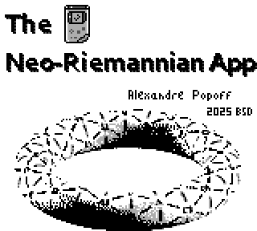
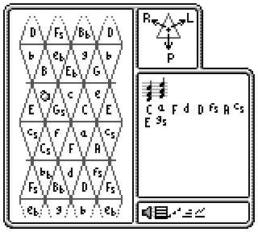

# NeoRiemannianGameBoy

   

A small ROM for doing Neo-Riemannian music theory on the Game Boy.

## What is it ?

As I was experimenting with the sound hardware on the Game Boy, I had
the idea to make a small ROM for the Game Boy to explore the Neo-Riemannian
Tonnetz.
If you don't know about Neo-Riemannian theory, there are multiple resources
on the Net about it. Check out [this](https://en.wikipedia.org/wiki/Neo-Riemannian_theory) or [this](https://alpof.wordpress.com/2014/01/26/an-introduction-to-neo-riemannian-theory-9/)) for example.

## How can I use it ?

Just download [the ROM](neoriemannian.gb) in this repo, and run it
on your emulator, or on a flash cart on an actual Game Boy if you have one !

## How does this work ?

Pressing SELECT will toggle between different modes: Tonnetz selection / Chord progression playback / Sound mode selection.

In *Tonnetz selection* mode, a blinking ball will indicate the current chord, which you can move around using the arrows.
Pressing START will play the current chord, according to the current sound mode.
Pressing B will add the chord to the progression, pressing A will remove the last chord from it.

In *Chord progression playback* mode, you can play the selected progression according to the current sound mode by pressing START.

In *Sound mode selection* you can select (left/right) the way the chords are played: plain chords, arpeggiated notes, chords with delayed
entry of voices, root bass with arpeggiated notes.

## Can I distribute the ROM ? Can I use the source code ?

Everything is released under the BSD-3 license.
